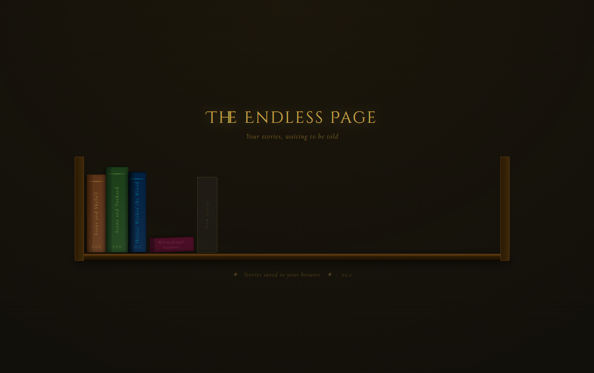

# The Endless Page

An AI-powered interactive fiction engine that lives in your browser as a wooden bookshelf. Each story you create becomes a physical book — spine, title, tilt and all. Pick it up, open it, and keep writing.

---

## What it is

The Endless Page is a single HTML file. No install, no backend, no account, no server. Open it in any browser and you get a fully functional AI story engine that saves everything locally to your machine.

You write a premise — one sentence, a character in trouble, a world you want to inhabit — and the AI takes over as co-author. Your story appears on the shelf as a book. Come back tomorrow and it's still there, mid-sentence, waiting.

**Guided Mode** — the narrator writes atmospheric prose then offers three choices. You pick a direction or write your own.

**Sandbox Mode** — no choices, no stops. Type anything your character does and the story continues.

---

## Features

- **Living bookshelf** — up to 12 concurrent stories rendered as physical books with varied heights, colours, and tilts
- **Five genre themes** — Fantasy, Sci-Fi, Horror, Romance, Adventure — each with a complete visual identity applied across every element of the interface
- **Automatic genre detection** — the theme adapts to your premise as you type
- **AI-generated titles** — your story gets an evocative title the moment it begins
- **Two-page spread layout** — scrollable history on the left, current scene on the right
- **Drop caps and serif typography** — Cormorant Garamond, EB Garamond, Cinzel Decorative
- **Text-to-speech narration** — toggle the narrator on or off at any time
- **Story export** — download any story as a `.txt` file
- **Offline fallback prose** — hand-written literary placeholders keep the atmosphere intact without AI
- **No install, no account, no backend** — drag the HTML file anywhere and open it

---

## Powered by Gemini 2.0 Flash

The Endless Page uses Google's Gemini API for story generation. You bring your own API key — it's stored only in your browser's local storage and sent directly to Google. Nothing passes through any third party.

**Getting a free Gemini API key:**
1. Go to [aistudio.google.com](https://aistudio.google.com) and sign in with any Google account
2. Click **Get API key** in the left sidebar
3. Click **Create API key** — no credit card required in most regions
4. Copy the key (starts with `AIza...`) and paste it into The Endless Page on first launch

---

## Getting Started

1. Download `index.html` from the latest release
2. Open it in any modern browser (Chrome, Firefox, Safari, Edge)
3. Enter your Gemini API key on the first screen — or click **Skip** to use offline fallback prose
4. Click the **+** slot on the bookshelf to begin your first story
5. Write a premise, choose a genre, pick a mode, and begin

That's it. No terminal, no npm, no dependencies.

---

## Version History

| Version | Key Changes |
|---------|-------------|
| v1.0 | Original — card-style flat bookshelf, basic AI integration |
| v1.1 | Wooden plank bookshelf, real book spines, proper TTS, Gemini integration |
| v2.0 | Rename modal, index-based choice system, 12 story slots |
| v2.1 | Escape closes modals, send button disabled during generation, dynamic tab title, SVG favicon, story export, version string |
| v2.2 | Three-tier choice parsing fallback, shelf layout fix for few books, offline banner |

---

## Architecture

Everything lives in one `index.html` — HTML, CSS, and JavaScript together. No bundler, no framework, no build step.

- **Persistence** — `localStorage` under keys `ep_slot_0` through `ep_slot_11`
- **AI layer** — Gemini 2.0 Flash via REST, with `gemini-2.0-flash-lite` as fallback
- **Theme system** — CSS custom properties switched per genre, no re-rendering required
- **Choice parsing** — three-tier regex fallback handles format variations from the model
- **Context window** — last 4 pages sent per request to keep token usage low

---

## Roadmap

- **v2.x** — narrative summarisation for long stories, voice selector for TTS, rename from shelf
- **v3.0** — Electron desktop app with the bookshelf rendered directly on the wallpaper as an ambient, always-present library

---

## Links

- **Play it** — [lord-juvens.itch.io/the-endless-page](https://lord-juvens.itch.io/the-endless-page)
- **Author** — [github.com/LordJuvens](https://github.com/LordJuvens)

---

*Built with AI assistance. The irony of using AI to build an AI story engine is not lost.*
